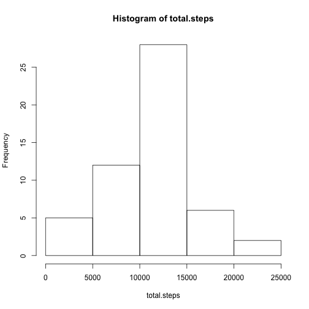
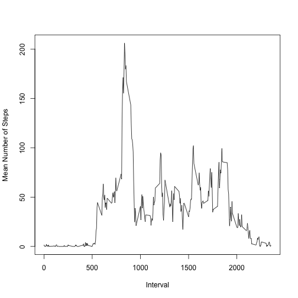
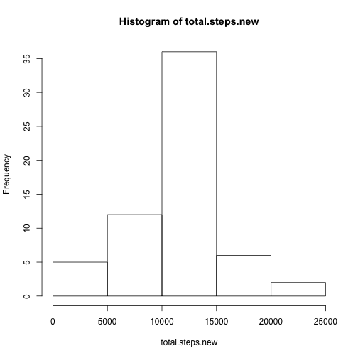
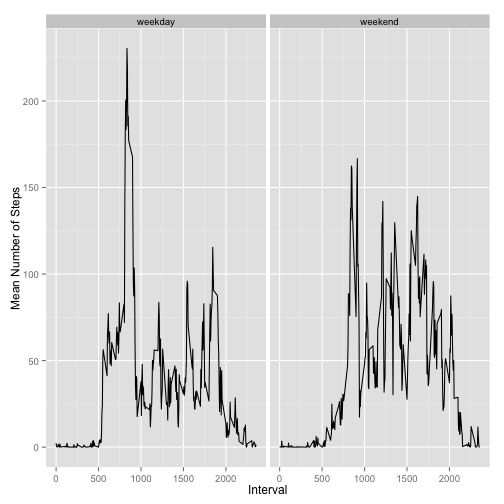

## Reading the Data
We begin by loading the data from a personal activity monitoring device attached to an anonymous individual. Data was collected during October and November 2012, recording the number of steps taken in five-minute intervals. Since the raw data contains many missing values, we subset the data to consider only complete cases.


```r
raw.data <- read.csv("activity.csv", na.strings="NA") 
data <- raw.data[complete.cases(raw.data),]
```

## Exploring the Number of Steps Taken per Day
We compute the total number of steps each day, aggregating the data by the **date** variable

```r
total.steps <- by(data$steps, data$date, function(x) sum(x))
```
We can now generate a histogram from the above vector. We select the number of bins using Sturges' criterion.

```r
hist(total.steps, breaks = 'Sturges')
```

 

Finally, we compute the mean and median of the total number of steps taken each day, and observe that the results are consistent with the histogram above.

```r
 mean(total.steps, na.rm = TRUE)
```

```
## [1] 10766.19
```

```r
 median(total.steps, na.rm = TRUE)
```

```
## [1] 10765
```

## Average Daily Activity Pattern
We can find the mean number of steps taken for each interval during the day and plot the resulting data as a time series.

```r
steps.in.interval <- by(data$steps, data$interval, function(x) mean(x))
intervals <- factor(data$interval)
plot(x = levels(intervals), y = steps.in.interval, type = 'l', xlab = 'Interval', ylab = 'Mean Number of Steps')
```

 

We can determine the interval for which the time series attains its maximum value by finding the maximum y-value in the curve and then evaluating its corresponding abscissa in the factor variable containing the intervals. We see that the maximum occurs for interval 835.

```r
intervals[[which.max(steps.in.interval)]]
```

```
## [1] 835
## 288 Levels: 0 5 10 15 20 25 30 35 40 45 50 55 100 105 110 115 120 ... 2355
```

## Replacing Missing Values in the Dataset
Many entries in the data have missing values for the number of steps taken in a given time interval. We can correct the data by replacing NA values with the mean number of steps taken in the particular interval corresponding to a given missing value. 

We begin by making a copy of the raw data set. We then create a vector with the mean number of steps for each interval and replace NA values in the **steps** variable according to the interval in the particular entry at hand. 

```r
 clean.data <- raw.data
 mean.steps <- sapply(clean.data$interval, function(x) steps.in.interval[which(levels(intervals) == x)])
 clean.data$steps[which(!complete.cases(clean.data))] <- mean.steps[which(!complete.cases(clean.data))]
```

Using this new data set, we can re-plot the histogram corresponding to the total number of steps per day.

```r
total.steps.new <- by(clean.data$steps, clean.data$date, function(x) sum(x))
hist(total.steps.new, breaks ='Sturges')
```

 

We can also compute the mean and median of the total number of steps per day using the new data set. We indeed see a change with respect to the values obtained without the missing data.

```r
mean(total.steps.new, na.rm = TRUE)
```

```
## [1] 10766.19
```

```r
median(total.steps.new, na.rm = TRUE)
```

```
## [1] 10766.19
```

## Investigating Activity Change During Weekends
We determine if a given date is a weekend or weekday using the **isWeekday()** function of the *timeDate* package. We update the **date** variable in the data with this information.

```r
library(timeDate)
clean.data$date <- sapply(clean.data$date, function(x) if(isWeekday(x)){'weekday'}else{'weekend'})
```

We can now use the *ggplot2* package to create a panel plot with the mean number of steps as a function of time interval.

```r
library(ggplot2)
ggplot(clean.data, aes(interval,steps)) + stat_summary(fun.y = "mean", geom = "line") + facet_grid(.~date) + xlab("Interval") + ylab("Mean Number of Steps")
```

 
